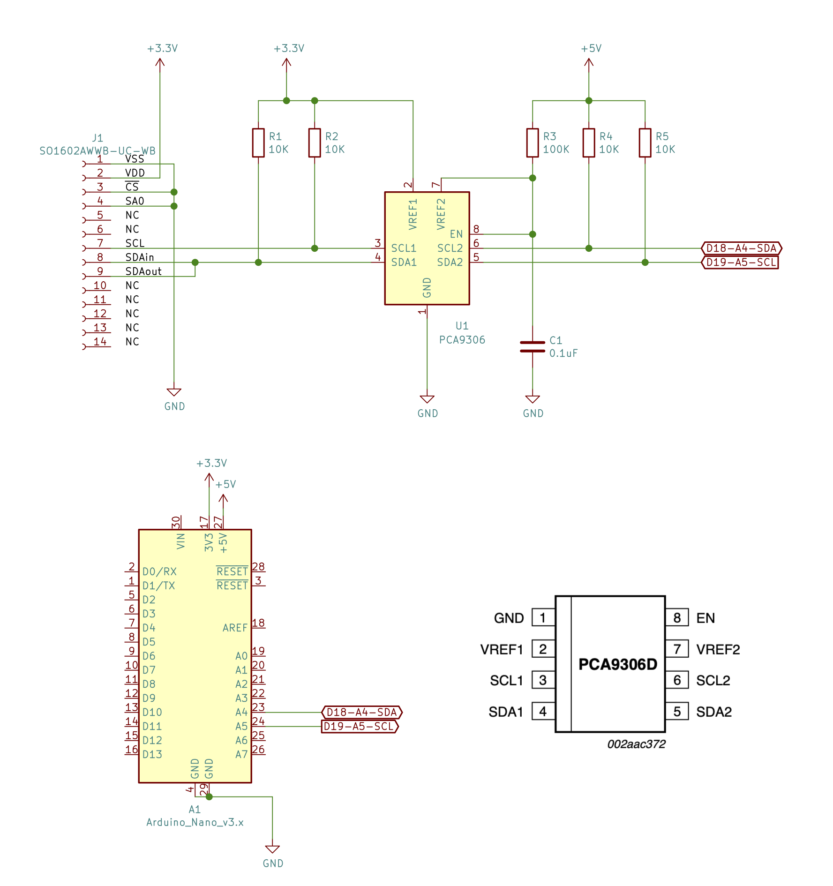

# SO1602AWWB-UC-WB Arduinoサンプルと簡易ライブラリ

秋月電子で販売している [OLED 16x2 キャラクタ表示器 SO1602AWWB-UC-WB](https://akizukidenshi.com/catalog/g/gP-08277/) の利用方法と簡易ライブラリです。起動からの秒数を表示します。

* 5V系Arduinoから [PCA9306D](https://akizukidenshi.com/catalog/g/gI-15017/) 経由で、3.3Vで利用します。
* もし他のプロジェクトで利用する場合は [app/SO1602AWWB.*](./app) を inoファイルと同じところにコピーして利用できます。
* MakefileはArduino-CLIと当方自作のArduino Nano互換ボードで利用する例ですが、書き換えることで他のArduinoからも利用できるとおもいます。また、Arduino-IDEからも使えると思います。

# 回路図

# Licence

MIT
